# Login dos alunos nos labs 5, 6 e 7

Criado em 2026-02-16

Atualizado em 2026-02-20

Por favor, leia o restante do documento ao menos uma vez. Os computadores dos labs podem ter características particulares aos modelos e versões de programas. 

Versão rápida: Ligue o computador, selecione o sistema operacional que deseja iniciar, na tela de autenticação digite [Usuário: a<seu número> , senha:<outro número>] tanto no Windows quanto no Linux. Não precisa especificar domínio. 

Podem existir usuários cadastrados na máquina local. Os docentes solicitam a criação desses usuários locais na Seção de Informática, isto é feito pelo técnico da informática manualmente em cada máquina. 

Usuários cadastrados na máquina local são úteis enquanto os alunos (ainda) não têm usuário cadastrado no servidor de autenticação dos laboratórios 5, 6, 7. O cadastramento dos usuários dos alunos no servidor de autenticação leva de duas a três semanas a partir do envio, pela Seção de Graduação, da lista de alunos matriculados, à Seção de informática.

## Versão com fotos

### Windows

Ao ligar o computador, durante alguns segundos, o usuário pode selecionar o Sistema Operacional que deseja usar através do menu e das setas do teclado.

Escolhendo Windows, o sistema operacional é iniciado e é apresentada a tela de login

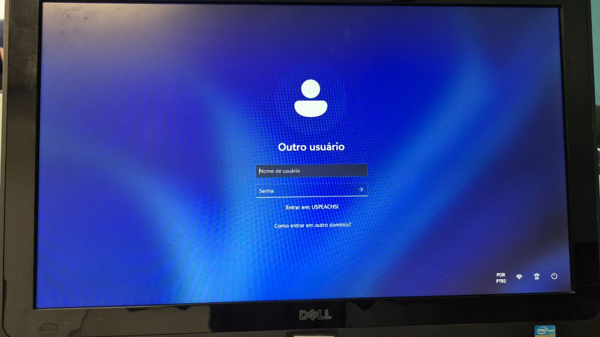

Selecione seu usuário, ou *Outro usuário*, preencha as caixas de texto com sua credencial e senha.

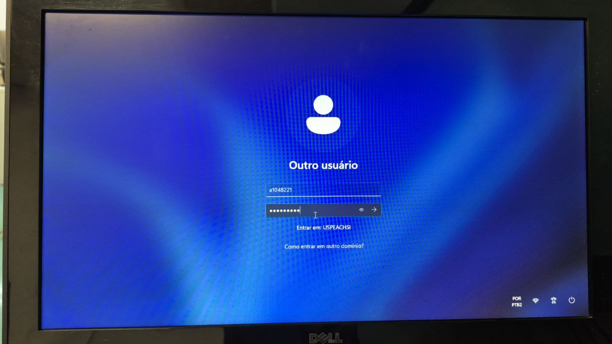

A informação é conferida pelo servidor de autenticação. Caso o login seja autorizado, o computador é liberado para uso. No primeiro uso do computador o ambiente é configurado, o que leva uns poucos minutos.

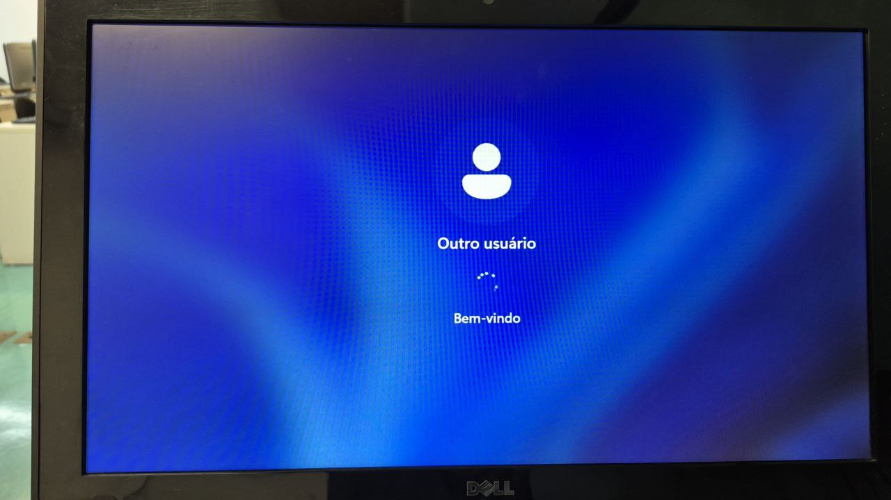

Execute os programas através do menu Iniciar - digite na caixa de pesquisa o nome do programa, por exemplo `cmd`, `codeblocks`, `notepad`, ... 

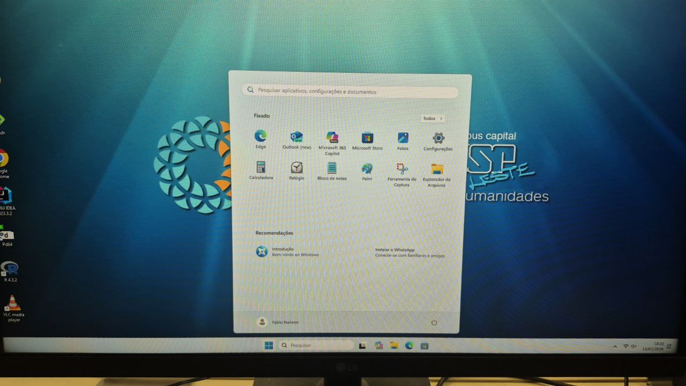

O tutorial sobre executar e testar code:blocks (https://github.com/FNakano/Codeblocks-Install-Test?tab=readme-ov-file#procedimento), a partir do passo 4 do procedimento,  pode ser uma boa continuação deste tutorial. Lembrar que usuários normais (alunos, professores) não podem instalar programas no computador, somente o administrador (técnico da Seção de Informática) pode fazê-lo. 

### Linux

Ao ligar o computador, durante alguns segundos, o usuário pode selecionar o Sistema Operacional que deseja usar através do menu e das setas do teclado.

Escolhendo Ubuntu, o sistema operacional é iniciado e é apresentada a tela de login

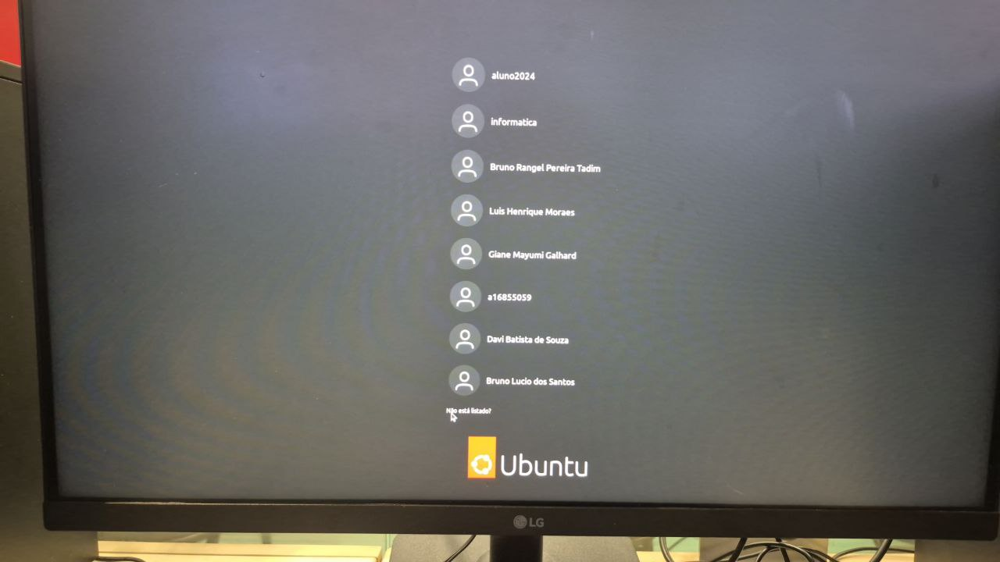

Selecione seu usuário, ou *Não está listado?*, preencha as caixas de texto com sua credencial e senha.

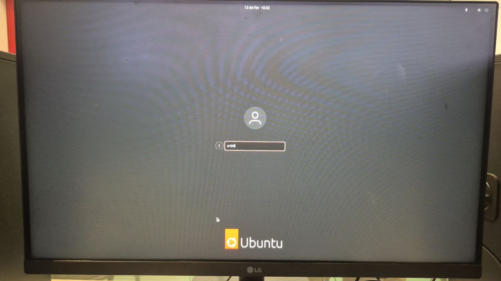

A informação é conferida pelo servidor de autenticação. Caso o login seja autorizado, o computador é liberado para uso. Caso seja o primeiro uso algumas perguntas podem ser feitas, clique em Ignorar/Cancelar/Não Atualizar.

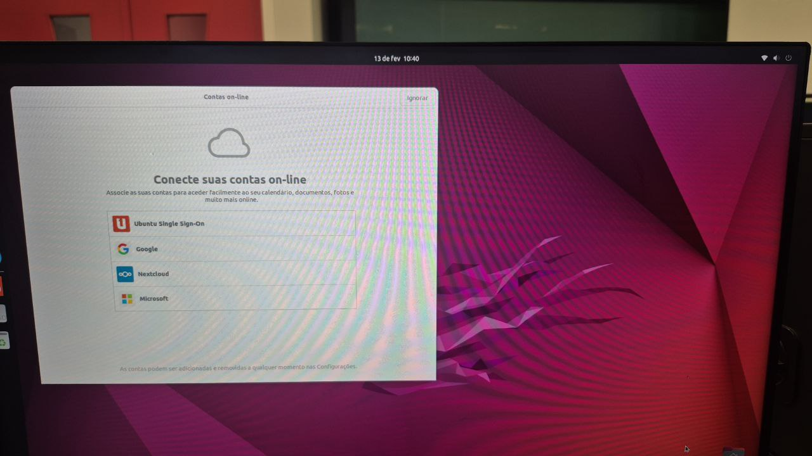

Caso o login não seja autorizado ou o servidor de autenticação não esteja acessível, uma tela semelhante a esta é mostrada. Isto pode acontecer quanto muitas pessoas e computadores tentam logar *simultaneamente* (é um tipo de DDoS). Outra possibilidade é estar no Lab6 - se for o caso, siga por este link: https://github.com/FNakano/LoginNosLabsSI?tab=readme-ov-file#lab6

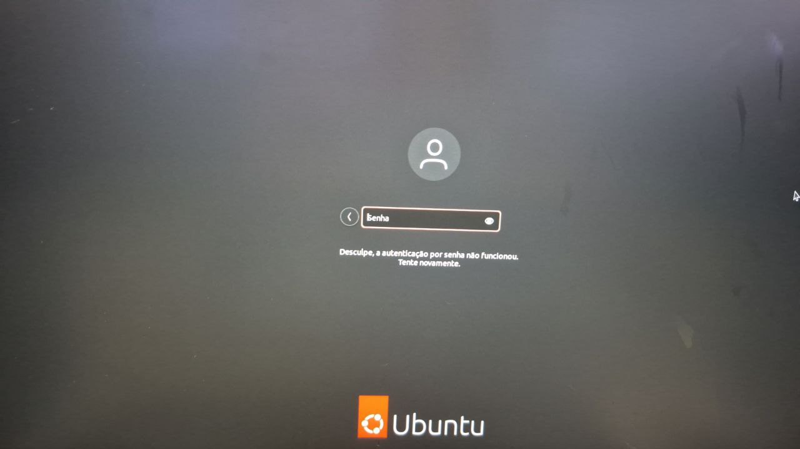

Execute os programas através do menu Mostrar programas

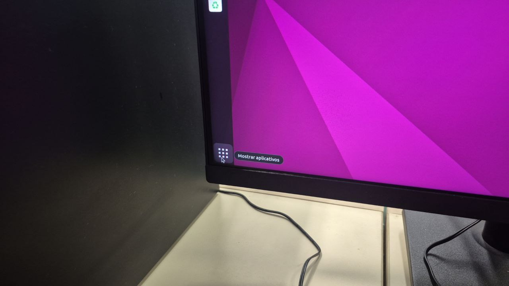

digite na caixa de pesquisa o nome do programa, por exemplo `terminal`, `gedit`, `nano`, ... 

file:///home/fabio/MeuGithub/LoginNosLabsSI/4933839644470741936.jpg

escolhendo o terminal, ou usando o atalho CRLR-ALT-t o terminal é aberto.

file:///home/fabio/MeuGithub/LoginNosLabsSI/4933839644470741937.jpg

O tutorial sobre como usar o shell Linux (https://github.com/FNakano/IP-Apostila/tree/main/ShellLinux) ou o Olá Mundo (https://github.com/FNakano/IP-Apostila/tree/main/InstalarTermux#escrever-um-programa-curto) podem ser boas continuações a partir deste ponto.

## Informação adicional

Mesmo que não haja conexão internet, os programas instalados nos computadores continuam úteis, mesmo que não seja possível baixar pacotes suplementares e consultar o help on line. Um usuário criado localmente, mesmo sem acesso à internet, pode ser suficiente.

### Como usar os compiladores C disponíveis em cada Sistema Operacional

### Particularidades

#### Lab6

Os computadores Daten, atualmente no lab 6, frequentemente não ativam a interface de rede WiFi quando ligados no Linux pela primeira vez. A solução é  iniciar o computador no Windows e reiniciar no Linux, não é necessário logar no Windows. Veja detalhes com fotos a seguir.

O login no Ubuntu pode falhar

Na tela de login do Ubuntu a falta do ícone de conexão na rede sem fio indica que o computador não conseguiu conectar-se à rede dos laboratórios.

Para resolver isso, reinicie o computador no Windows e volte para o Ubuntu

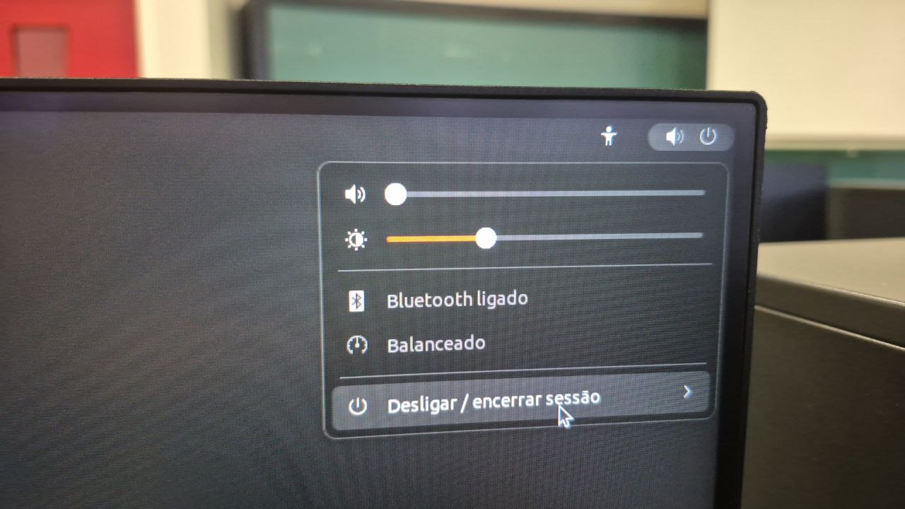

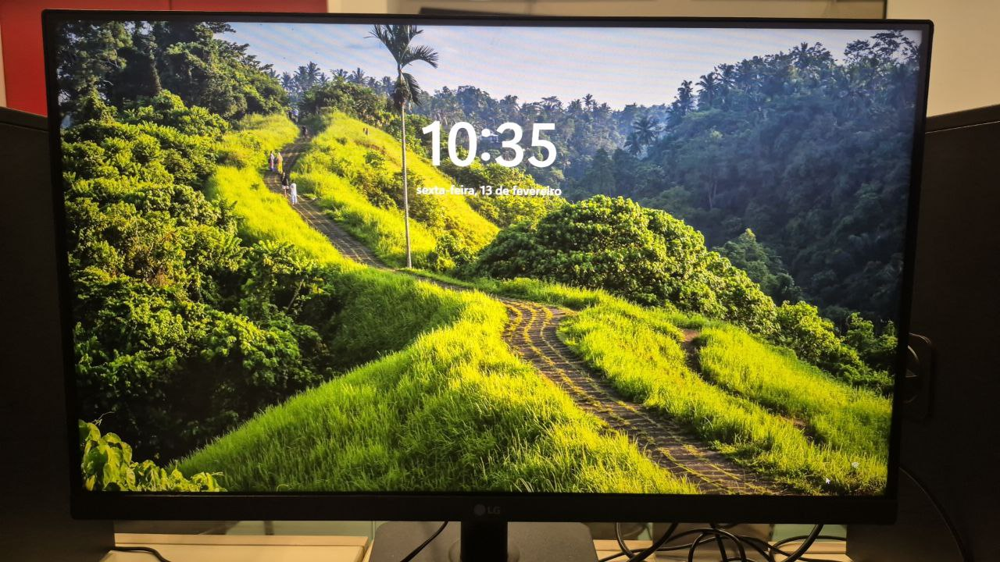

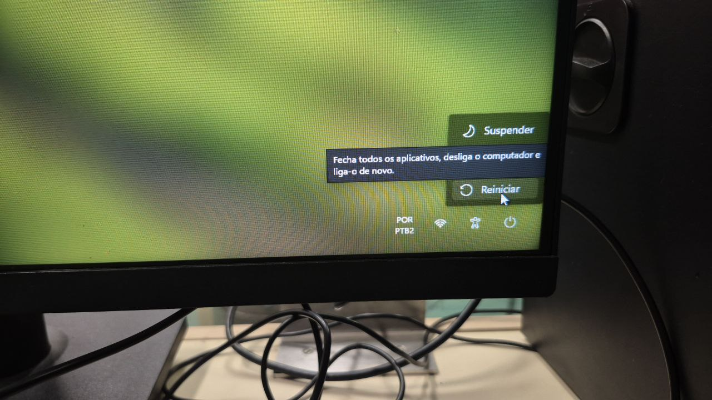

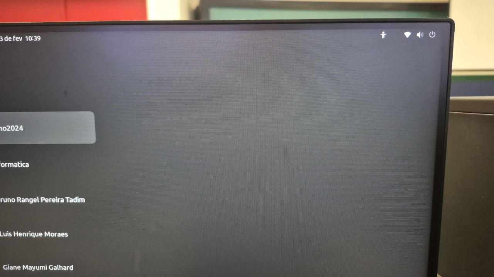

É possível, no Windows, checar a conexão à rede :
  
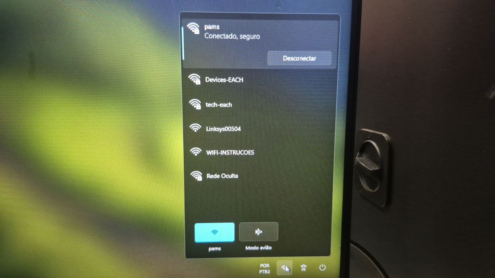

## Comentários e Correções

Caso tenha alguma sugestão ou comentário, no menu do alto da página use *Discussions*. Caso queira informar um erro, no menu do alto da página use *Issues*. Caso queira propor uma nova versão para este documento, faça *Pull Request*. Nos três casos as propostas serão analisadas - não há garantia que a sugestão seja adotada. 
